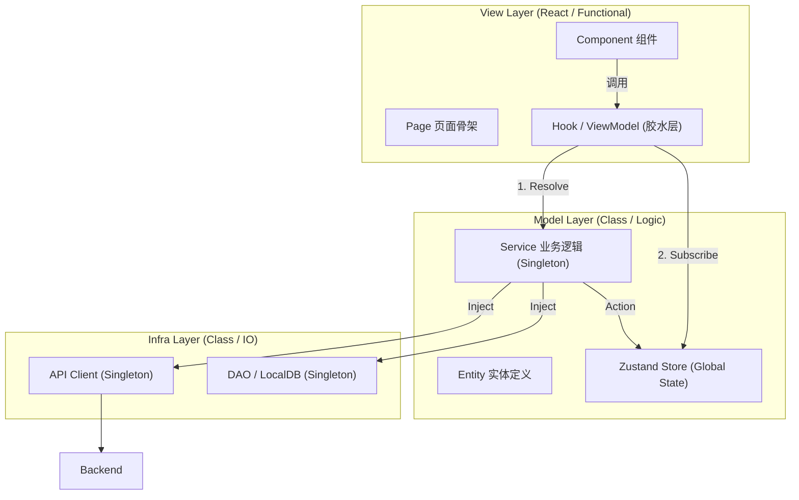

## react+ts+zustand的mvvm实现的最佳目录规范：

```plaintext
src/
├── view/                    # 视图层
│   ├── components/          # 无状态 UI 组件
    │   ├── ui/                  # shadcn/ui 原子组件
    │   ├── common/              # 全局通用业务组件
    │   ├── providers/           # 全局 Context Providers
│   ├── pages/               # 页面骨架
│   └── features/            # 按功能模块拆分
│       └── [FeatureName]/
│           ├── components/  # 功能专用组件
│           └── hooks/       # ViewModel 层
│
├── model/                   # 模型层
│   ├── stores/              # Zustand 全局状态
│   ├── services/            # 业务逻辑
│   ├── events/              # 事件系统（可选）
│   └── entities/            # 实体类型定义
│
├── infra/                   # 基础设施层
│   ├── api/                 # 后端 API 交互
│   └── dao/                 # 本地数据库访问
│
└── common/                  # 公共模块
    ├── lib/                 # 第三方库封装
    └── utils/               # 工具函数
```

## 结合DI之后的架构图：
  

典型的：

- **view** → 表现层（React）
    
- **model** → 业务层（Domain + Application）
    
- **infra** → 基础设施层（API、DB、Storage）
    
- **common** → 公共工具
    

## 如何管理类的生命周期

用 DI 来做 class 生命周期管理，会让 model/service 和 infra 完整分离，达到最优聚合。

---

### 🎯 什么时候应该使用 tsyringe（DI）？

你的架构里 **适合注入的只有 “Class 实例”**：

|层|是否用 tsyringe 注入？|理由|
|---|---|---|
|view (React Component / ViewModel Hook)|❌ 不使用|React hook 管理状态，不适合 class 注入|
|model/store (Zustand Store)|❌ 不适合 DI|Store 是函数创建的，不是 class|
|**model/service**|✔ **强烈推荐**|要管理业务逻辑生命周期|
|model/event|✔ 视情况|EventBus 类很适合单例|
|model/entity|❌ 不必|实体一般只是类型定义或普通对象|
|**infra/api**|✔ **必须 DI**|作为全局单例，避免重复实例化|
|**infra/dao**|✔ **必须 DI**|IndexedDB/sql.js/localstorage 客户端都应单例|
|common/lib/util|❌ 不使用|纯函数无需 DI|

---

### 🧱 最推荐的生命周期

```
(App 启动)
  │
  ▼
Infra (api/dao) ———> 单例
  │
  ▼
Model (service/event) ———> 单例
  │
  ▼
ViewModel（hook） ———> 页面级生命周期
  │
  ▼
View（组件） ———> React 控制
```

**service、api、dao 全部交给 tsyringe 统一管理 → 最佳实践**